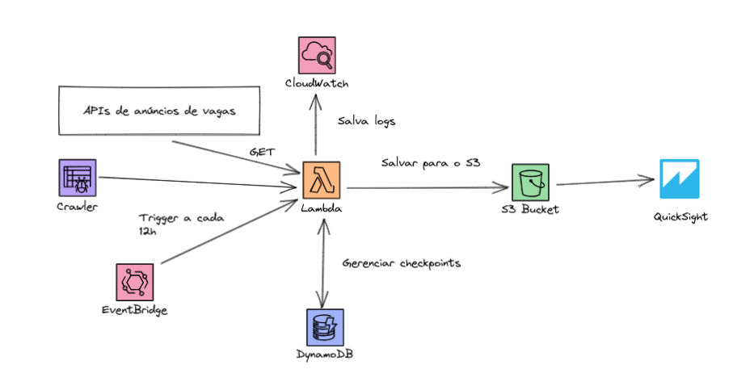

# How Bootcamp - Engenharia de Dados

## Checkpoint-5

### Proposta do Projeto:

- Objetivo do projeto: fornecer recurso para gestão à vista (dashboard) de anúncios de vagas de trabalho relacionadas a dados (Engenharia, Ciência e Análise de Dados)

- Motivação: monitoramento otimizado de vagas visando aplicação/candidatura

- Resultados esperados: maior rapidez de acesso às informações organizadas de maneira centralizada e com metadados em melhor granularidade em relação à maioria das plataformas do tipo; obtenção de insights (ex.: crescimento do uso de um tipo de linguagem, framework ou demanda genérica...)
 
### Desenho do projeto:

- Métodos a utilizar: web scrapping e requisições em APIs públicas de plataformas de recrutamento e seleção

- Serviços a utilizar: Crawler, EventBridge, DynamoDB, Lambda, CloudWatch, S3, QuickSight

